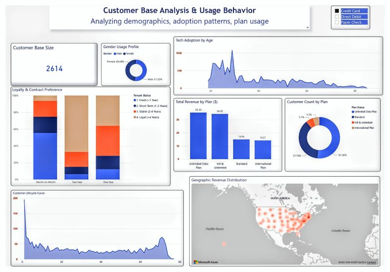

# Customer-Analysis-PowerBI
Analytics dashboard visualizing customer demographics, revenue hotspots, and churn risk.
Exploring:

​1- 𝗖𝘂𝘀𝘁𝗼𝗺𝗲𝗿 𝗗𝗲𝗺𝗼𝗴𝗿𝗮𝗽𝗵𝗶𝗰𝘀: Analyzed the demographic and geographic distribution of the customer base to accurately pinpoint Revenue Hotspots.

​2- 𝗨𝘀𝗮𝗴𝗲 𝗕𝗲𝗵𝗮𝘃𝗶𝗼𝗿 & 𝗧𝗲𝗰𝗵 𝗔𝗱𝗼𝗽𝘁𝗶𝗼𝗻: Explored usage patterns (calls & data) to reveal strong correlations between age demographics and technology adoption rates.

​3- 𝗙𝗶𝗻𝗮𝗻𝗰𝗶𝗮𝗹 𝗣𝗲𝗿𝗳𝗼𝗿𝗺𝗮𝗻𝗰𝗲 & 𝗟𝗼𝘆𝗮𝗹𝘁𝘆: Evaluated service plans to calculate the Average Revenue Per User (ARPU) and assessed how contract types influence customer loyalty and lifecycle.

****
